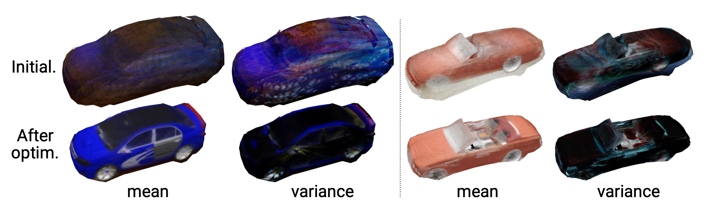

## Photometric Mesh Optimization for Video-Aligned 3D Object Reconstruction
[Chen-Hsuan Lin](https://chenhsuanlin.bitbucket.io/),
[Oliver Wang](http://www.oliverwang.info/),
[Bryan C. Russell](http://bryanrussell.org/),
[Eli Shechtman](https://research.adobe.com/person/eli-shechtman),
[Vladimir G. Kim](http://www.vovakim.com/),
[Matthew Fisher](https://techmatt.github.io/),
and [Simon Lucey](http://www.simonlucey.com/)  
IEEE Conference on Computer Vision and Pattern Recognition (CVPR), 2019  

Project page: https://chenhsuanlin.bitbucket.io/photometric-mesh-optim  
Paper: https://chenhsuanlin.bitbucket.io/photometric-mesh-optim/paper.pdf  
arXiv preprint: https://arxiv.org/abs/1903.08642  

<p align="center"></p>

We provide PyTorch code for the following experiments:
- ShapeNet+SUN360 sequences
- (coming soon!) Real-world videos

--------------------------------------

### Prerequisites

This code is developed with Python3 (`python3`). PyTorch 0.4.0 is required.
(Note that 1.0.0 does not work due to the removal of the `cffi` dependency.)  

First, create a Python virtual environment by running
```
virtualenv -p python3 PMO
```
Before installing dependencies and/or running the code, activate the virtual environment by running
```
source PMO/bin/activate
```
The dependencies can be installed by running (within the virtual environment) 
```
pip3 install --upgrade -r requirements.txt
```

--------------------------------------

### Dataset

#### Test sequences
The test sequences are composited from the leave-out set of ShapeNet and SUN360.
To download the dataset (64GB), run the script file `download_sequences.sh` under the directory `data`.  
After downloading, run `tar -zxf sequences.tar.gz` under the directory `data`. The files will be extracted to a directory `sequences`.

#### ShapeNet renderings
We render images from ShapeNet with higher quality (with resolution of 224x224).
To download the dataset (33GB), run the script file `download_rendering.sh` under the directory `data`.  
After downloading, run `tar -xf rendering.tar`. The files will be extracted to a directory `rendering`.

#### ShapeNet point clouds
Please follow the instructions in the AtlasNet [repository](https://github.com/ThibaultGROUEIX/AtlasNet) to download the ground-truth point clouds.
The directory `customShapeNet` should be placed under the directory `data`.

#### SUN360 cropped backgrounds
The cropped background images from SUN360 (92GB) can be downloaded by running the script file `download_background.sh` under the directory `data`.  
After downloading, run `tar -xf background.tar`. The files will be extracted to a directory `background`.

--------------------------------------

### Pretrained models
The pretrained models (626MB each) can be downloaded by running the command
```
wget https://cmu.box.com/shared/static/oryysitkhn2eldgb90qkr3lh7j469sj1.npz # airplane
wget https://cmu.box.com/shared/static/jgif23ytibtektwwcji8wiv0jbubzs08.npz # car
wget https://cmu.box.com/shared/static/zakir5pi9xma4l3d5c2g74i8r0lggp36.npz # chair
```

--------------------------------------

### Compiling the CUDA libraries
The `meshrender` library can be compiled by running `./build.sh` under the directory `meshrender`.  
The `chamfer` library is precompiled from the AtlasNet [repository](https://github.com/ThibaultGROUEIX/AtlasNet).

--------------------------------------

### Running the code

To try a demo of the photometric mesh optimization, download our pretrained model for [cars](https://cmu.box.com/shared/static/jgif23ytibtektwwcji8wiv0jbubzs08.npz).
Then run (setting the `model` variable to the downloaded checkpoint)
```
model=pretrained/02958343_atl25.npz
python3 main.py --load=${model} --code=5e-2 --scale=2e-2 --lr-pmo=3e-3 --noise=0.1 --video
```
This will create the following output files:
1. the optimized object mesh (saved into the directory `optimized_mesh`),
2. the input video sequence with the overlayed 3D mesh (saved to `video`), and
3. (coming soon!) a 3D mesh model (in `.obj` format) with textures estimated from the input RGB sequence.

The flags `--log-tb` and `--log-vis` toggles visualization of the optimization process.
More optional arguments can be found by running `python3 main.py --help`.  

### Pretraining
To pretrain AtlasNet with our new dataset (high-resolution ShapeNet rendering + SUN360 cropped backgrounds), run the following command (taking the airplane category for example)
```
cat=02691156
python3 main_pretrain.py --category=${cat} --name=${cat}_pretrain \
	--imagenet-enc --pretrained-dec=pretrained/ae_atlasnet_25.pth
```
By default, we initialize the encoder with an ImageNet-pretrained ResNet-18 and the decoder with the pretrained AtlasNet (Please refer to the AtlasNet [repository](https://github.com/ThibaultGROUEIX/AtlasNet) for downloading their pretrained models).  
More optional arguments can be found by running `python3 main_pretrain.py --help`.  

#### Visualizing the results  
We've included code to visualize the training over TensorBoard(X). To execute, run
```
tensorboard --logdir=summary/GROUP --port=6006
```
where `GROUP` is specified in the pretraining arguments.  
For pretraining, we provide three types of data visualization:  
1. **SCALARS**: training and test loss curves over epochs  
2. **IMAGES**: sample input images  

--------------------------------------

If you find our code useful for your research, please cite
```
@inproceedings{lin2019photometric,
  title={Photometric Mesh Optimization for Video-Aligned 3D Object Reconstruction},
  author={Lin, Chen-Hsuan and Wang, Oliver and Russell, Bryan C and Shechtman, Eli and Kim, Vladimir G and Fisher, Matthew and Lucey, Simon},
  booktitle={IEEE Conference on Computer Vision and Pattern Recognition ({CVPR})},
  year={2019}
}
```

Please contact me (chlin@cmu.edu) if you have any questions!
